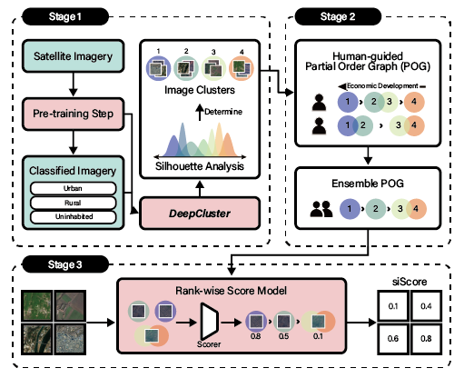

## Contents   

__Figure__  
1. [__Figure1__](#Figure1)  
2. [__Figure2__](#Figure2)  
3. [__Figure3__](#Figure3)  
4. [__Figure4__](#Figure4)  
5. [__Figure5__](#Figure5)
6. [__Figure6__](#Figure6)  

__Table__  
1. [__Table1__](#Table1) 

---
## Figure1
  
__Illustration of the proposed model(_siScore_).__

The model is composed of (1) machine-driven clustering of satellite images, (2) human guidance on the partial order graph (POG) of image clusters, and (3) a machine-driven rank-wise scoring model to compute siScore. A POG contains information on the relative ranking of each cluster’s development, perceived and judged by each participating human. Knowledge from multiple POGs is summarized as a single representative POG using an ensemble process. This representative POG is then used by the scoring model.

[Back to top](#Contents)

---  

## Figure2  
  
__Visualization of economic development levels predicted by our human-machine collaboration model.__  

(A) Prediction scores over grid images averaged over four years from 2016 to 2019, (B) shows the yearly aggregated VIIRS nightlight data in 2019, and (C) shows the land cover classification map released by the South Korean Government in 2019. The zoomed-in views in (D–F) compare predictions for Sepho County in the Kangwon region. From left to right are the Sentinel-2 satellite images taken in 2019 (D), model predictions (E), and manually verified buildings colored red from the building footprint data in 2014 (F).

### Detail  

Materials path : `../Codes/Fig2_ref/`  

[Back to top](#Contents)

---  

## Figure3  
  
__Comparison of model performance in terms of economic indicator prediction for the human-machine collaborative model and four other baselines (NL-regression, NL-guided, Land cover-guided, and RWI) on North Korea and least developed countries (LDCs) in Asia.__  

Based on the GDP per capita (at current prices USD, 2019), we select five countries that have a similar economic rank to North Korea (198th): Nepal (183rd), Myanmar (174th), Cambodia (169th), Bangladesh (164th), Laos (154th) (16). The grid-level evaluation is based on the density of building area (North Korea) and population estimates (LDCs in Asia) as a proxy for economic development. The district-level performance is calculated using official statistics from census and surveys: density of building area (North Korea), population, establishments and employment (LDCs in Asia). Note that Spearman’s rank correlation coefficient is more appropriate to evaluate our model as the model is targeted to predict rank-wise scores.  

### Detail  

Materials path : `../Codes/Fig3_ref/`  
Key file : `Fig_evaluation.xlsx`  

[Back to top](#Contents)

---  

## Figure4  
  
__The changes in siScore in North Korea from 2016 to 2019.__ 

(Left) The changes in North Korea. (Right) Examples of Sentinel-2 images and siScore in model predictions between 2016 and 2019. The top images present industrial development areas in Wiwon county. The bottom images present the recently constructed Kalma tourist project of Wonsan city. The boundaries of these development projects are drawn as red lines. The bottom pictures reveal more vivid changes due to new buildings and roads compared to the top pictures.  

### Detail  

Materials path : `../Codes/Fig4_ref/`  
Key file :   

[Back to top](#Contents)

---  

## Figure5  
 
__Model interpretability with Grad-CAM results (2016-2019).__  

(A) Grad-CAM heatmap visualization over a grid image of the Ryongyon region from 2016 to 2019, indicating the reclaimed land as being a critical factor in the change of economic development scores. (B) Grad-CAM heatmap over three areas of interest: Samjiyon development project, Kalma tourist project, and Nyongbyun nuclear scientific research center. All three sites show growth in economic development and the heatmap highlights the key areas contributed to the score change. The model can detect subtle changes in roofing and road network in the Nyongbyun nuclear site that would be otherwise hard to detect with human eyes.  

### Detail  

Materials path : `../Codes/Fig5_ref/`  
Key file :   `../Codes/Main_Fig5.ipynb`  

[Back to top](#Contents)

---  

## Figure6  
 
__Visualization of economic development predicted by the human-machine collaboration model for North Korea and the 5 least developed countries in Asia.__  

(A) Predictions scores over grid images from 2016 to 2019. The scores are standardized for visualization. The blue area indicates an area which is not available for the satellite images. The zoomed-in views (B-C) compare economic development predictions for Cambodia. (B) provides 3D visualization of siScore, while (C) provides VIIRS nightlight data in 2019.  

### Detail  

Materials path : `../Codes/Fig6_ref/`  
Key file :     

[Back to top](#Contents)

---  

## Table1
  
__Grid-level regression estimates (2016-2019).__  

Notes: This table reports ordinary least squares (OLS) regression estimates. The outcome variable in columns (1) and (2) is the difference of logarithmized values between 2016 and 2019. Columns (3) and (4) use an indicator for positive change as the outcome variable. Logistic regression gives similar results. All specifications include province fixed effects, log of district population in 2008, and log of district area. Standard errors are clustered at province level and reported in parentheses. * denotes statistical significance at 0.10, ** at 0.05, and *** at 0.01.

### Detail  

Materials path : `../Codes/Table1_ref/`  
Key file :    

[Back to top](#Contents)

---  