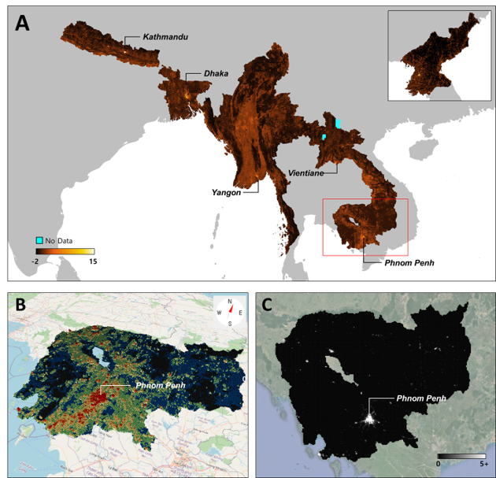

## Contents   

__Figure__  
1. [__Figure1__](#Figure1)  
2. [__Figure2__](#Figure2)  
3. [__Figure3__](#Figure3)  
4. [__Figure4__](#Figure4)  
5. [__Figure5__](#Figure5)
6. [__Figure6__](#Figure6)  

__Table__  
1. [__Table1__](#Table1) 

---
## Figure1
  

**Illustration of the proposed model(_siScore_).**

The model is composed of (1) machine-driven clustering of satellite images, (2) human guidance on the partial order graph (POG) of image clusters, and (3) a machine-driven rank-wise scoring model to compute siScore. A POG contains information on the relative ranking of each cluster’s development, perceived and judged by each participating human. Knowledge from multiple POGs is summarized as a single representative POG using an ensemble process. This representative POG is then used by the scoring model.

[Back to top](#Contents)

---  

## Figure2  
  

**Visualization of economic development levels predicted by our human-machine collaboration model.**  

(A) Prediction scores over grid images averaged over four years from 2016 to 2019, (B) shows the yearly aggregated VIIRS nightlight data in 2019, and (C) shows the land cover classification map released by the South Korean Government in 2019. The zoomed-in views in (D–F) compare predictions for Sepho County in the Kangwon region. From left to right are the Sentinel-2 satellite images taken in 2019 (D), model predictions (E), and manually verified buildings colored red from the building footprint data in 2014 (F).

### Figure2 (A)
1. Open ‘NK_siScore_grid.shp’ with QGIS software program. 
2. Set coordinate system of QGIS project by ‘Project’ tap > ‘Properties’ > ‘CRS’ > choose ‘WGS 84 / UTM zone 52N’ 
3. Double click ‘NK_siScore_grid’ and go to the ‘symbology’ tab of layer properties. Choose ‘Graduated’ symbol function to create graduated symbols for siScore. Choose ‘4years’ for the value. Change mode from ‘Equal Count (Quantile)’ to ‘Equal Interval’. Change the number of classes as 30. 
4. Press the box of ‘color ramp’ to change color ramp. Set as below.
        Color point 1 : RGB (0, 0, 0) Relative Position (0.0%)
        Color point 2 : RGB (231, 94, 20) Relative Position (48.4%)
        Color point 3 : RGB (245, 209, 0) Relative Position (71.8%)
        Color point 4 : RGB (255, 255, 255) Relative Position (91.7%)
        Color point 5 : RGB (255, 255, 255) Relative Position (100.0%)

 

5. Put the black base North Korea boundary shapefile (‘NK_Boundary_2008.shp’) as a background.

 

6. Export the image and put labels and a legend with Microsoft Powerpoint program. 

Materials path : `../SpatialData/`  
Key file : `NK_siScore_grid.shp`  

### Figure2 (B)
1. Go to https://eogdata.mines.edu/nighttime_light/annual/v20/2019/
2. Download ‘VNL_v2_npp_2019_global_vcmslcfg_c202101211500.average.tif.gz’ Note that this file is not uploaded to Github due to copyright issue.
3. Upload the yearly aggregated VIIRS nightlight data to QGIS program. 
4. Clip the extent of the Nighlight data area to the boundary of North Korea with ‘NK_Boundary_2008.shp’.
5. Export the image and put a legend with Microsoft Powerpoint program. 

### Figure2 (C)
1. Download the North Korea landcover map from the Ministry of Environment (MoE) of South Korea. Note that this file is not uploaded to Github due to copyright issue. 
2. Upload the landcover map to QGIS program. It automatically sets the color for each class. 
3. Export the image and put a legend with Microsoft Powerpoint program. 

 

### Figure2 (D)
1. Download Sentinel-2 image from https://earthexplorer.usgs.gov/
2. Download Sentinel-2 tile image ‘T52SCH’. Note that this file is not uploaded to Github due to copyright issue. 
3. Open ‘T52SCH’ image with QGIS. Also open ‘NK_siScore_grid.shp’ to show the grids. 
4. Double click ‘NK_siScore_grid’ and go to the ‘symbology’ tab of layer properties. 
5. Click ‘simple fill’ and change ‘fill style’ from ‘solid’ to ‘No brush’.
6. Zoom to Sepho county. The coordinate of Sepho county is ‘127.3644,38.5261’.

 

7. Export the image and put a label with Microsoft Powerpoint program. 

### Figure2 (E)
1. Zoom in the image of ‘Figure 2. A.’ to Sepho county. The coordinate of Sepho county is ‘127.3644,38.5261’.

 

2. Export the image and put a label with Microsoft Powerpoint program. 

### Figure2 (F)

1. Open ‘building footprint shapefile’ of North Korea with QGIS. You can download the shapefile from the National Geographic Information Institute (NGII) in South Korea. Note that this file is not uploaded to Github due to copyright issue. 
2. Double click shapefile layer and go to the ‘symbology’ tab of layer properties. 
3. Click color box and change color to red. 
4. Open ‘NK_siScore_grid.shp’ to show the grids. Double click ‘NK_siScore_grid’ and go to the ‘symbology’ tab of layer properties. 
5. Click ‘simple fill’ and change ‘fill style’ from ‘solid’ to ‘No brush’.
6. Zoom to Sepho county. The coordinate of Sepho county is ‘127.3644,38.5261’.

  

7. Export the image and put a label with Microsoft Powerpoint program. 

[Back to top](#Contents)

---  

## Figure3  
  

**Comparison of model performance in terms of economic indicator prediction for the human-machine collaborative model and four other baselines (NL-regression, NL-guided, Land cover-guided, and RWI) on North Korea and least developed countries (LDCs) in Asia.**  

Based on the GDP per capita (at current prices USD, 2019), we select five countries that have a similar economic rank to North Korea (198th): Nepal (183rd), Myanmar (174th), Cambodia (169th), Bangladesh (164th), Laos (154th) (16). The grid-level evaluation is based on the density of building area (North Korea) and population estimates (LDCs in Asia) as a proxy for economic development. The district-level performance is calculated using official statistics from census and surveys: density of building area (North Korea), population, establishments and employment (LDCs in Asia). Note that Spearman’s rank correlation coefficient is more appropriate to evaluate our model as the model is targeted to predict rank-wise scores.  

### Detail
Materials path : `../Codes/Fig3_ref/`  
Key file : `Fig3_evaluation.xlsx`  

Open ‘Fig3_evaluation.xlsx’.

* For evaluation results for 'Building area' at the grid-level
    * Nepal : Go to ‘grid_Nepal’ tab. Do spearman correlation between:
        * Human-machine: ‘building_area’ and ‘siScore’ column
        * NL-regression: ‘building_area’ and ‘NL-regression’ column
        * NL-guided: ‘building_area’ and ‘NL-guided’ column 
        * Land cover-guided: ‘building_area’ and ‘LULC-guided’ column
        * RWI: ‘building_area’ and ‘RWI’ column (Note: ‘RWI’ column has some nodata value.)

    * Bangladesh : Go to ‘grid_Bangladesh’ tab. Do spearman correlation between:
        * Human-machine: ‘building_area’ and ‘siScore’ column (Note: ‘building_area’ column has some nodata value.)
        * NL-regression: ‘building_area’ and ‘NL-regression’ column (Note: ‘building_area’ column has some nodata value.)
        * NL-guided: ‘building_area’ and ‘NL-guided’ column (Note: ‘building_area’ column has some nodata value.)
        * Land cover-guided: ‘building_area’ and ‘LULC-guided’ column (Note: ‘building_area’ column has some nodata value.)
        * RWI: ‘building_area’ and ‘RWI’ column (Note: ‘building_area’ and ‘RWI’ column has some nodata value.)
        
    * North Korea : Go to ‘grid_NK’ tab. Do spearman correlation between:
        * Human-machine: ‘ln(building_area)’ and ‘siScore_4years’ column
        * NL-regression: ‘ln(building_area)’ and ‘NL-regression’ column
        * NL-guided: ‘ln(building_area)’ and ‘NL-guided’ column 
        * Land cover-guided: ‘ln(building_area)’ and ‘LC-guided’ column

* For evaluation results for 'Population' at the grid-level
    * Nepal : Go to ‘grid_Nepal’ tab. Do spearman correlation between:
        * Human-machine: ‘Population’ and ‘siScore’ column
        * NL-regression: ‘Population’ and ‘NL-regression’ column
        * NL-guided: ‘Population’ and ‘NL-guided’ column 
        * Land cover-guided: ‘Population’ and ‘LULC-guided’ column
        * RWI: ‘Population’ and ‘RWI’ column (Note: ‘RWI’ column has some nodata value.)

    * Myanmar : Go to ‘grid_Myanmar’ tab. Do spearman correlation between:
        * Human-machine: ‘Population’ and ‘siScore’ column
        * NL-regression: ‘Population’ and ‘NL-regression’ column
        * NL-guided: ‘Population’ and ‘NL-guided’ column 
        * Land cover-guided: ‘Population’ and ‘LULC-guided’ column

    * Cambodia : Go to ‘grid_cambodia’ tab. Do spearman correlation between:
        * Human-machine: ‘Population’ and ‘siScore’ column
        * NL-regression: ‘Population’ and ‘NL-regression’ column
        * NL-guided: ‘Population’ and ‘NL-guided’ column 
        * Land cover-guided: ‘Population’ and ‘LULC-guided’ column
        * RWI: ‘Population’ and ‘RWI’ column (Note: ‘RWI’ column has some nodata value.)

    * Bangladesh : Go to ‘grid_Bangladesh’ tab. Do spearman correlation between:
        * Human-machine: ‘Population’ and ‘siScore’ column
        * NL-regression: ‘Population’ and ‘NL-regression’ column
        * NL-guided: ‘Population’ and ‘NL-guided’ column 
        * Land cover-guided: ‘Population’ and ‘LULC-guided’ column
        * RWI: ‘Population’ and ‘RWI’ column (Note: ‘RWI’ column has some nodata value.)

    * Laos : Go to ‘grid_Laos’ tab. Do spearman correlation between:
        * Human-machine: ‘Population’ and ‘siScore’ column
        * NL-regression: ‘Population’ and ‘NL-regression’ column
        * NL-guided: ‘Population’ and ‘NL-guided’ column 
        * Land cover-guided: ‘Population’ and ‘LULC-guided’ column
        * RWI: ‘Population’ and ‘RWI’ column (Note: ‘RWI’ column has some nodata value.)

* For evaluation for 'Building area' at the district-level
    * North Korea : Go to ‘district_NK’ tab. Calculate R-square between:
        * Human-machine: ‘ln(Building area)’ and ‘ln(siScore4years)’ column
        * NL-regression: ‘ln(Building area)’ and ‘ln(NL-regression)’ column
        * NL-guided: ‘ln(Building_area)’ and ‘ln(NL-guided)’ column 
        * Land cover-guided: ‘ln(Building_area)’ and ‘ln(LULC-guided)’ column

* For evaluation for 'Establishment' at the district-level
    * North Korea : Go to ‘district_NK’ tab. Calculate R-square between:
        * Human-machine: ‘ln(Establishment)’ and ‘ln(siScore4years)’ column
        * NL-regression: ‘ln(Establishment)’ and ‘ln(NL-regression)’ column
        * NL-guided: ‘ln(Establishment)’ and ‘ln(NL-guided)’ column 
        * Land cover-guided: ‘ln(Establishment)’ and ‘ln(LULC-guided)’ column

    * Nepal : Go to ‘district_Nepal’ tab. Calculate R-square between:
        * Human-machine: ‘lnEstab’ and ‘lnsiScore’ column
        * NL-regression: ‘lnEstab’ and ‘lnNL-regression’ column
        * NL-guided: ‘lnEstab’ and ‘lnNL-guided’ column 
        * Land cover-guided: ‘lnEstab’ and ‘lnLULC-guided’ column
        * RWI: ‘lnEstab’ and ‘RWI’ column 

    * Cambodia : Go to ‘district_cambodia’ tab. Calculate R-square between:
        * Human-machine: ‘ln(Establishment)’ and ‘lnsiScore’ column
        * NL-regression: ‘ln(Establishment)’ and ‘lnNL-regression’ column
        * NL-guided: ‘ln(Establishment)’ and ‘lnNL-guided’ column 
        * Land cover-guided: ‘ln(Establishment)’ and ‘lnLULC-guided’ column
        * RWI: ‘ln(Establishment)’ and ‘RWI’ column.

    * Bangladesh : Go to ‘district_Bangladesh’ tab. Calculate R-square correlation between:
        * Human-machine: ‘lnESTABden’ and ‘lnsiScore’ column
        * NL-regression: ‘lnESTABden’ and ‘lnNL-regression’ column
        * NL-guided: ‘lnESTABden’ and ‘lnNL-guided’ column 
        * Land cover-guided: ‘lnESTABden’ and ‘lnLULC-guided’ column
        * RWI: ‘lnESTABden’ and ‘RWI’ column.

* For evaluation for 'Employment' at the district-level
    * Nepal : Go to ‘district_Nepal’ tab. Calculate R-square between:
        * Human-machine: ‘lnEmploy’ and ‘lnsiScore’ column
        * NL-regression: ‘lnEmploy’ and ‘lnNL-regression’ column
        * NL-guided: ‘lnEmploy’ and ‘lnNL-guided’ column 
        * Land cover-guided: ‘lnEmploy’ and ‘lnLULC-guided’ column
        * RWI: ‘lnEmploy’ and ‘RWI’ column 

    * Myanmar : Go to ‘district_Myanmar tab. Calculate R-square between:
        * Human-machine: ‘lnEMPden’ and ‘lnsiScore’ column
        * NL-regression: ‘lnEMPden’ and ‘lnNL-regression’ column
        * NL-guided: ‘lnEMPden’ and ‘lnNL-guided’ column 
        * Land cover-guided: ‘lnEMPden’ and ‘lnLULC-guided’ column

    * Cambodia : Go to ‘district_cambodia’ tab. Calculate R-square between:
        * Human-machine: ‘ln(Employment)’ and ‘lnsiScore’ column
        * NL-regression: ‘ln(Employment)’ and ‘lnNL-regression’ column
        * NL-guided: ‘ln(Employment)’ and ‘lnNL-guided’ column 
        * Land cover-guided: ‘ln(Employment)’ and ‘lnLULC-guided’ column
        * RWI: ‘ln(Employment)’ and ‘RWI’ column.

    * Bangladesh : Go to ‘district_Bangladesh’ tab. Calculate R-square correlation between:
        * Human-machine: ‘lnEMPLOYden’ and ‘lnsiScore’ column
        * NL-regression: ‘lnEMPLOYden’ and ‘lnNL-regression’ column
        * NL-guided: ‘lnEMPLOYden’ and ‘lnNL-guided’ column 
        * Land cover-guided: ‘lnEMPLOYden’ and ‘lnLULC-guided’ column
        * RWI: ‘lnEMPLOYden’ and ‘RWI’ column.

* For evaluation for 'Population' at the district-level
    * North Korea : Go to ‘district_NK’ tab. Calculate R-square between:
        * Human-machine: ‘ln(Population)’ and ‘ln(siScore4years)’ column
        * NL-regression: ‘ln(Population)’ and ‘ln(NL-regression)’ column
        * NL-guided: ‘ln(Population)’ and ‘ln(NL-guided)’ column 
        * Land cover-guided: ‘ln(Population)’ and ‘ln(LULC-guided)’ column

    * Nepal : Go to ‘district_Nepal’ tab. Calculate R-square between:
        * Human-machine: ‘lnPop’ and ‘lnsiScore’ column
        * NL-regression: ‘lnPop’ and ‘lnNL-regression’ column
        * NL-guided: ‘lnPop’ and ‘lnNL-guided’ column 
        * Land cover-guided: ‘lnPop’ and ‘lnLULC-guided’ column
        * RWI: ‘lnPop’ and ‘RWI’ column 

    * Myanmar : Go to ‘district_Myanmar tab. Calculate R-square between:
        * Human-machine: ‘lnPOPden’ and ‘lnsiScore’ column
        * NL-regression: ‘lnPOPden’ and ‘lnNL-regression’ column
        * NL-guided: ‘lnPOPden’ and ‘lnNL-guided’ column 
        * Land cover-guided: ‘lnPOPden’ and ‘lnLULC-guided’ column

    * Cambodia : Go to ‘district_cambodia’ tab. Calculate R-square between:
        * Human-machine: ‘ln(Population)’ and ‘lnsiScore’ column
        * NL-regression: ‘ln(Population)’ and ‘lnNL-regression’ column
        * NL-guided: ‘ln(Population)’ and ‘lnNL-guided’ column 
        * Land cover-guided: ‘ln(Population)’ and ‘lnLULC-guided’ column
        * RWI: ‘ln(Population)’ and ‘RWI’ column.

    * Bangladesh : Go to ‘district_Bangladesh’ tab. Calculate R-square correlation between:
        * Human-machine: ‘lnPOPden’ and ‘lnsiScore’ column
        * NL-regression: ‘lnPOPden’ and ‘lnNL-regression’ column
        * NL-guided: ‘lnPOPden’ and ‘lnNL-guided’ column 
        * Land cover-guided: ‘lnPOPden’ and ‘lnLULC-guided’ column
        * RWI: ‘lnPOPden’ and ‘RWI’ column.

    * Laos : Go to ‘district_Laos’ tab. Calculate R-square correlation between:
        * Human-machine: ‘lnPOP15den’ and ‘lnsiScore’ column
        * NL-regression: ‘lnPOP15den’ and ‘lnNL-regression’ column
        * NL-guided: ‘lnPOP15den’ and ‘lnNL-guided’ column 
        * Land cover-guided: ‘lnPOP15den’ and ‘lnLULC-guided’ column
        * RWI: ‘lnPOP15den’ and ‘RWI’ column.

[Back to top](#Contents)

---  

## Figure4  
  

**The changes in siScore in North Korea from 2016 to 2019.** 

(Left) The changes in North Korea. (Right) Examples of Sentinel-2 images and siScore in model predictions between 2016 and 2019. The top images present industrial development areas in Wiwon county. The bottom images present the recently constructed Kalma tourist project of Wonsan city. The boundaries of these development projects are drawn as red lines. The bottom pictures reveal more vivid changes due to new buildings and roads compared to the top pictures.  

### Figure 4 (Left)
 
1. Open ‘NK_siScore_grid.shp’ with QGIS software program.
2. Set coordinate system of QGIS project by ‘Project’ tap > ‘Properties’ > ‘CRS’ > choose ‘WGS 84 / UTM zone 52N’ 
3. Double click ‘NK_siScore_grid’ and go to the ‘symbology’ tab of layer properties. Choose ‘Graduated’ symbol function to create graduated symbols for siScore. Choose ‘19_16’ for the value. Change mode from ‘Equal Count (Quantile)’ to ‘Equal Interval’. Change the number of classes as 7. 
4. Set ‘color ramp’ as ‘Spectral’. Right-click the color box and press ‘invert Color Ramp’.
5. Set the class values as below.

 

6. Put the black base North Korea boundary shapefile (‘NK_Boundary_2008.shp’) as background.

 

7. Export the image and put labels and a legend with Microsoft Powerpoint program. 

Materials path : `../SpatialData/`  
Key file : `NK_siScore_grid.shp`  

### Figure 4 (Top-right)

1. Download Sentinel-2 image from https://earthexplorer.usgs.gov/. 
2. Download Sentinel-2 tile image ‘T51TYF’. Note that this file is not uploaded to Github due to copyright issue.
3. Open ‘T51TYF’ image with QGIS.
4. Zoom to Wiwon county. The coordinate of Wiwon county is ‘126.09060,40.86591’
5. Open ‘NK_siScore_grid.shp’ to show the grids. 
6. Double click ‘NK_siScore_grid’ and go to the ‘symbology’ tab of layer properties. 
7. Click ‘simple fill’ and change ‘fill style’ from ‘solid’ to ‘No brush’.
8. Export the image.

9. Draw the boundary of Wiwon project with Microsoft Powerpoint program. You can find the boundary from the reference cited at the manuscript and Supplementary materials. Put labels with Powerpoint program.

### Figure 4 (Bottom-Right)

1. Download Sentinel-2 image from https://earthexplorer.usgs.gov/
2. Download Sentinel-2 tile image ‘T52SCJ’. Note that this file is not uploaded to Github due to copyright issue.
3. Open ‘T52SCJ’ image with QGIS.
4. Zoom to Wonsan city. The coordinate of Wonsan city is ‘127.487479,39.174753’
5. Open ‘NK_siScore_grid.shp’ to show the grids. 
6. Double click ‘NK_siScore_grid’ and go to the ‘symbology’ tab of layer properties. 
7. Click ‘simple fill’ and change ‘fill style’ from ‘solid’ to ‘No brush’.
8. Export the image.

9. Draw the boundary of Kalma tourist project with Powerpoint program. You can find the boundary from the reference cited at the manuscript and Supplementary materials. Put labels with Powerpoint program.

[Back to top](#Contents)

---  

## Figure5  
 

**Model interpretability with Grad-CAM results (2016-2019).**    

(A) Grad-CAM heatmap visualization over a grid image of the Ryongyon region from 2016 to 2019, indicating the reclaimed land as being a critical factor in the change of economic development scores. (B) Grad-CAM heatmap over three areas of interest: Samjiyon development project, Kalma tourist project, and Nyongbyun nuclear scientific research center. All three sites show growth in economic development and the heatmap highlights the key areas contributed to the score change. The model can detect subtle changes in roofing and road network in the Nyongbyun nuclear site that would be otherwise hard to detect with human eyes.  

### Detail  

Materials path : `../Codes/Fig5_ref/`  
Key file :   `../Codes/Main_Fig5.ipynb`  

[Back to top](#Contents)

---  

## Figure6  
 

**Visualization of economic development predicted by the human-machine collaboration model for North Korea and the 5 least developed countries in Asia.**  

(A) Predictions scores over grid images from 2016 to 2019. The scores are standardized for visualization. The blue area indicates an area which is not available for the satellite images. The zoomed-in views (B-C) compare economic development predictions for Cambodia. (B) provides 3D visualization of siScore, while (C) provides VIIRS nightlight data in 2019.  

### Figure6 (A) 

1. Open ‘5countries.shp’ and ‘5countries_cloud.shp’ with QGIS software program. 
2. Set coordinate system of QGIS project by ‘Project’ tap > ‘Properties’ > ‘CRS’ > choose ‘WGS 84’ 
3. Double click ‘5countries.shp’ and go to the ‘symbology’ tab of layer properties. Choose ‘Graduated’ symbol function to create graduated symbols for siScore. Choose ‘siScore’ for the value. Change mode from ‘Equal Count (Quantile)’ to ‘Equal Interval’. Change the number of classes as 30. 
4. Press the box of ‘color ramp’ to change color ramp. Set as below.
        Color point 1 : RGB (0, 0, 0) Relative Position (0.0%)
        Color point 2 : RGB (231, 94, 20) Relative Position (48.4%)
        Color point 3 : RGB (245, 209, 0) Relative Position (71.8%)
        Color point 4 : RGB (255, 255, 255) Relative Position (91.7%)
        Color point 5 : RGB (255, 255, 255) Relative Position (100.0%)

 

5. Double click ‘5countries_cloud.shp’ and go to the ‘symbology’ tab of layer properties. Change color to (0, 255, 255). 

 

6. Download ‘continent shapefile’ from https://hub.arcgis.com/datasets/esri::world-continents/explore?location=3.062048%2C-53.293423%2C2.64
7. Upload ‘continent shapefile’ for a background image. Set the color of 'continent shapefile' as gray.
8. Follow the same step for Figure 2 (A). Export images of five countries and North Korea. 
9. Put labels and a legend with Microsoft Powerpoint program.

Materials path : `../SpatialData/`  
Key file : `5countries.shp`     

### Figure6 (B)
1. Open ‘Fig_6_3D.qlr’ file with QGIS. Check if QGIS Layer definition file is connected with ‘5countries.shp’ correctly. 
2. Open OpenStreetMap for background. You can open OpenStreetmap with ‘XYZ Tiles’ tool of QGIS.
3. Set coordinate system of QGIS project by ‘Project’ tap > ‘Properties’ > ‘CRS’ > choose ‘WGS 84 / UTM zone 46N’ 
4. Use 3D map by ‘View’ tap > ‘New 3D Map view’

 

5. Scroll wheel to make it 3D view. 
6. Select only grids of Cambodia to show 3D visualization of siScore in Cambodia.
7. Print screen and open it with Microsoft Powerpoint software. Put labels and a north arrow. 

Materials path : `../SpatialData/`  
Key file : `Fig_6_3D.qlr`     

### Figure6 (C)
1. Go to https://eogdata.mines.edu/nighttime_light/annual/v20/2019/
2. Download ‘VNL_v2_npp_2019_global_vcmslcfg_c202101211500.average.tif.gz’
3. Upload the yearly aggregated VIIRS nightlight data to QGIS program. Note that this file is not uploaded to Github due to copyright issue.  
4. Clip the extent of the data area to the boundary of Cambodia, using 'KHM_Boundary.shp'
5. Open Google Satellite Imagery for background. You can open Google Satellite imagery with ‘XYZ Tiles’ tool of QGIS.
6. Print screen and open it with Microsoft Powerpoint software. Put labels and a legend. 

Materials path : `../SpatialData/`  
Key file : `KHM_Boundary.shp`

[Back to top](#Contents)

---  

## Table1
  

**Grid-level regression estimates (2016-2019).**  

Notes: This table reports ordinary least squares (OLS) regression estimates. The outcome variable in columns (1) and (2) is the difference of logarithmized values between 2016 and 2019. Columns (3) and (4) use an indicator for positive change as the outcome variable. Logistic regression gives similar results. All specifications include province fixed effects, log of district population in 2008, and log of district area. Standard errors are clustered at province level and reported in parentheses. * denotes statistical significance at 0.10, ** at 0.05, and *** at 0.01.

### Detail  

Materials path : `../Codes/Table1_ref/`  
Key file :    

[Back to top](#Contents)

---  