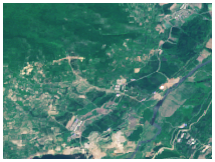
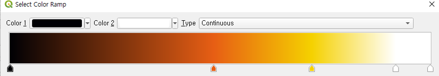
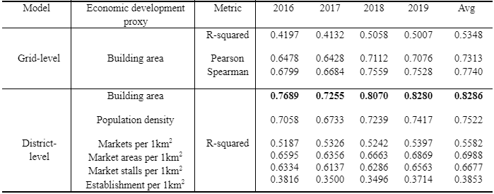
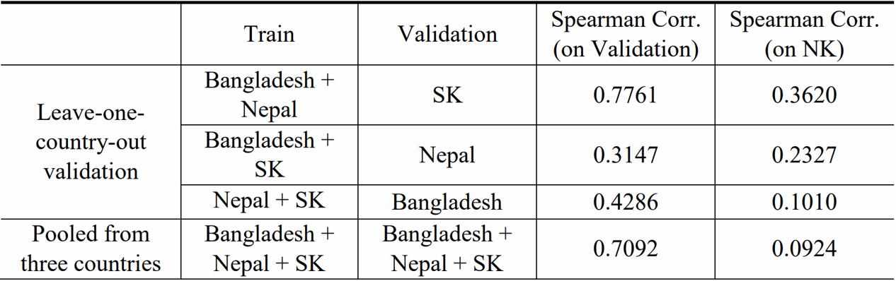

## Contents   

__Figure__  
1. [__FigureS1__](#FigureS1)  
2. [__FigureS2__](#FigureS2)  
3. [__FigureS3__](#FigureS3)  
4. [__FigureS4__](#FigureS4)  
5. [__FigureS5__](#FigureS5)
6. [__FigureS6__](#FigureS6)
7. [__FigureS7__](#FigureS7)
8. [__FigureS8__](#FigureS8)
9. [__FigureS9__](#FigureS9)
10. [__FigureS10__](#FigureS10)

__Table__  
1. [__TableS1__](#TableS1)  
2. [__TableS2__](#TableS2)  
3. [__TableS3__](#TableS3)  
4. [__TableS4__](#TableS4)  
5. [__TableS5__](#TableS5)  
6. [__TableS6__](#TableS6)  
7. [__TableS7__](#TableS7)  
8. [__TableS8__](#TableS8)  
9. [__TableS9__](#TableS9)  
10. [__TableS10__](#TableS10)  

---
## FigureS1
  

### FigureS1 (A)  

1. Download the North Korea landcover map from the Ministry of Environment (MoE) of South Korea. Note that this file is not uploaded to Github due to copyright issue. 
2. Upload the landcover map to QGIS program. It automatically sets the color for each class. 
3. Open ‘NK_siScore_grid.shp’ to show the grids. 
4. Double click ‘NK_siScore_grid’ and go to the ‘symbology’ tab of layer properties. 
5. Click ‘simple fill’ and change ‘fill style’ from ‘solid’ to ‘No brush’.
6. Zoom to Rason city. The coordinate of Rason city is ‘130.29645,42.23617’.
7. Export the image and put a legend with Microsoft Powerpoint program. 

 

### FigureS1 (B) 

1. Open ‘building footprint shapefile’ of North Korea with QGIS. You can download the shapefile from the National Geographic Information Institute (NGII) in South Korea. Note that this file is not uploaded to Github due to copyright issue. 
2. Double click shapefile layer and go to the ‘symbology’ tab of layer properties. 
3. Click color box and change color to red. 
4. Open ‘NK_siScore_grid.shp’ to show the grids. Double click ‘NK_siScore_grid’ and go to the ‘symbology’ tab of layer properties. 
5. Click ‘simple fill’ and change ‘fill style’ from ‘solid’ to ‘No brush’.
6. Zoom to Rason city. The coordinate of Rason city is ‘130.29645,42.23617’.
7. Export the image and put a legend with Microsoft Powerpoint program. 

[Back to top](#Contents)

---  

## FigureS2  
  

### FigureS2 (A)

Materials path : `../SpatialData/`  
Key file : `NK_district_statistics.shp` 

1. Open 'NK_district_statistics.shp' with QGIS program.
2. Double click shapefile layer and go to the ‘symbology’ tab of layer properties. Choose ‘Graduated’ symbol function to create graduated symbols for population. Choose ‘Popden08’ for the value. Change mode from ‘Equal Count (Quantile)’ to ‘Natural Breaks (Jenks)’. Change the number of classes as 30. 
3. Change color ramp to 'Oranges'. 
4. Export the image and put a legend with Microsoft Powerpoint software.

### FigureS2 (B)

Materials path : `../SpatialData/`  
Key file : `NK_grid_building.shp` 

1. Open 'NK_district_statistics.shp' with QGIS program as background. Double click shapefile layer and go to the ‘symbology’ tab of layer properties. Fill color with black.
2. Open 'NK_grid_building.shp'.
2. Double click shapefile layer and go to the ‘symbology’ tab of layer properties. Choose ‘Graduated’ symbol function to create graduated symbols for building density. Choose ‘BuildDEN’ for the value. Change mode from ‘Equal Count (Quantile)’ to ‘Natural Breaks (Jenks)’. Change the number of classes as 30. 
3. Change color ramp to 'Viridis'. 
4. Export the image and put a legend with Microsoft Powerpoint software.

### FigureS2 (C)

Materials path : `../SpatialData/`  
Key file : `NK_district_statistics.shp` 

1. Open 'NK_district_statistics.shp' with QGIS program.
2. Double click shapefile layer and go to the ‘symbology’ tab of layer properties. Choose ‘Graduated’ symbol function to create graduated symbols for Market area per 1km2. Choose ‘Market18ar’ for the value. Change mode from ‘Equal Count (Quantile)’ to ‘Natural Breaks (Jenks)’. Change the number of classes as 30. 
3. Change color ramp to 'YlGnBu'. 
4. Export the image and put a legend with Microsoft Powerpoint software.

### FigureS2 (D)

Materials path : `../SpatialData/`  
Key file : `NK_district_statistics.shp` 

1. Open 'NK_district_statistics.shp' with QGIS program.
2. Double click shapefile layer and go to the ‘symbology’ tab of layer properties. Choose ‘Graduated’ symbol function to create graduated symbols for Establishment area per 1km2. Choose ‘Estab19num’ for the value. Change mode from ‘Equal Count (Quantile)’ to ‘Natural Breaks (Jenks)’. Change the number of classes as 30. 
3. Change color ramp to 'RdPu'. 
4. Export the image and put a legend with Microsoft Powerpoint software.

### FigureS2 (E)

Materials path : `../SpatialData/`  
Key file : `NK_mines.shp` 

1. Open 'NK_district_statistics.shp' with QGIS program as background. Double click shapefile layer and go to the ‘symbology’ tab of layer properties. Fill color with white.
2. Open 'NK_mines.shp'.
3. Double click shapefile layer and go to the 'symbology' tab of layer properties. Choose ‘Categorized’ symbol function to create categorized symbols for mines. Choose ‘Type’ for the value. 
4. Except 'coal', 'copper', 'gold', 'iron', and 'uranium', remove other class. 
5. Uncheck 'all other values'.
6. Set color for each class as below.

7. Export the image and put a legend with Microsoft Powerpoint program. 

### FigureS2 (F)

Materials path : `../SpatialData/`  
Key file : `NK_SEZ_EDZ.shp`, `NK_ports.shp`, `NK_checkpoint.shp`,  `NK_nuclear.shp` 

1. Open 'NK_district_statistics.shp' with QGIS program as background. Double click shapefile layer and go to the ‘symbology’ tab of layer properties. Fill color with white.
2. Open `NK_SEZ_EDZ.shp`, `NK_ports.shp`, `NK_checkpoint.shp`, and `NK_nuclear.shp`. 
3. Double click shapefile layer and go to the ‘symbology’ tab of layer properties. Choose small circles with different colors for each shapefile.
4. Export the image and put symbols over the circles with Microsoft Powerpoint software. 

  
    
    
    
    

[Back to top](#Contents)

---  

## FigureS3  
  

### Detail  

Materials path : `../SpatialData/`  
Key file : `NK_district_statistics.shp` 

1. Open 'NK_district_statistics.shp' with QGIS program as background. Double click shapefile layer and go to the ‘symbology’ tab of layer properties. Make the boundary color red.
2. Select 'Hyesan City' and make it a only visible feature. 
3. Open 'NK_siScore_gird.shp'. Make the boundary color White.
4. Open Google Satellite Imagery as background.
5. Export the image and add lines, a legend, and vertices of girds with Microsoft Powerpoint program. 

  
    
    

[Back to top](#Contents)

---  

## FigureS4  
  

The silhouette analysis of North Korea's urban and rural clusters.  
A high silhouette score indicates well-separated clusters where each image’s distance from its own cluster is smaller than that from the nearest neighbor cluster over the embedding space.  
Please see `../../Stage1/Readme.md` for more information

### Detail  
Materials path : `../../Stage1/`  

[Back to top](#Contents)

---  

## FigureS5  
  

Three representative HQ functions demonstrate their superiority over the conventional L2 loss, especially for large ordering deviances.  
Among them, our algorithm utilizes the Welsch function for the ensemble process because of its robustness against outliers.

[Back to top](#Contents)

---  

## FigureS6  
  

Illustration of the POG generation process. Each cluster contains satellite images that show similar visual patterns of human artifacts and landscapes. Human participants assess clusters by visually inspecting the images in each cluster, to finally order the clusters by the level of economic development.  

[Back to top](#Contents)

---  

## FigureS7  
  

### Detail  

1. Download Sentinel-2 satellite images from usgs earthexplorer website. The file is not uploaded to Github due to copyright issue.
2. Download North Korea land cover classification map from MoE of South Korea. This file is also not uploaded to Github due to copyright issue. 
3. Clip Sentinel-2 images and land cover classification map with the extent of zoom-level 14 grids. 

  
    
    
  
    
    

  
    
    
  
    
    

4. Calculate the area of used area from clipped land cover classification map.
5. Put images and labels on Microsoft Powerpoint program.

[Back to top](#Contents)

---  

## FigureS8  
  

### Detail  

1. Open ‘Fig_S8_3D.qlr’ file with QGIS. Check if QGIS Layer definition file is connected with ‘NK_siScore_district.shp’ correctly. 
2. Open Google Satellite iMagery for background. You can open Google Satellite iMagery with ‘XYZ Tiles’ tool of QGIS.
3. Set coordinate system of QGIS project by ‘Project’ tap > ‘Properties’ > ‘CRS’ > choose ‘WGS 84 / UTM zone 52N’ 
4. Use 3D map by ‘View’ tap > ‘New 3D Map view’
5. Scroll wheel to make it 3D view. 
6. Print screen and open it with Microsoft Powerpoint software. Put labels and a north arrow. 

Materials path : `../SpatialData/`  
Key file : `Fig_S8_3D.qlr`  

[Back to top](#Contents)

---  

## FigureS9  
  

### FigureS9 (Top)

1. Open ‘NK_siScore_grid.shp’ with QGIS software program.
2. Set coordinate system of QGIS project by ‘Project’ tap > ‘Properties’ > ‘CRS’ > choose ‘WGS 84 / UTM zone 52N’ 
3. Double click ‘NK_siScore_grid’ and go to the ‘symbology’ tab of layer properties. Choose ‘Graduated’ symbol function to create graduated symbols for siScore. Choose ‘year2016’ for the value. Change mode from ‘Equal Count (Quantile)’ to ‘Equal Interval’. Change the number of classes as 30. 
4. Press the box of ‘color ramp’ to change color ramp. Set as below.
        Color point 1 : RGB (43, 131, 186) Relative Position (0.0%)
        Color point 2 : RGB (171, 221, 164) Relative Position (10.0%)
        Color point 3 : RGB (255, 255, 191) Relative Position (20.0%)
        Color point 4 : RGB (253, 174, 97) Relative Position (50.0%)
        Color point 5 : RGB (215, 25, 28) Relative Position (100.0%)

 

5. Put the black base North Korea boundary shapefile (‘NK_Boundary_2008.shp’) as background.
6. Export the image of siScore 2016 and put labels and a legend with Microsoft Powerpoint program. 
7. Double click ‘NK_siScore_grid’ at QGIS and go to the ‘symbology’ tab of layer properties. Choose ‘Graduated’ symbol function to create graduated symbols for siScore. Choose ‘year2019’ for the value. 
8. Export the image of siScore 2019 and put labels and a legend with Microsoft Powerpoint program. 

Materials path : `../SpatialData/`  
Key file : `NK_siScore_grid.shp`  

### FigureS9 (Bottom)

1. Open ‘NK_siScore_grid.shp’ with QGIS software program.
2. Set coordinate system of QGIS project by ‘Project’ tap > ‘Properties’ > ‘CRS’ > choose ‘WGS 84 / UTM zone 52N’ 
3. Double click ‘NK_siScore_grid’ and go to the ‘symbology’ tab of layer properties. Choose ‘Graduated’ symbol function to create graduated symbols for siScore. Choose ‘19_16’ for the value. Change mode from ‘Equal Count (Quantile)’ to ‘Equal Interval’. Change the number of classes as 7. 
4. Set ‘color ramp’ as ‘Spectral’. Right-click the color box and press ‘invert Color Ramp’.
5. Set the class values as below.

 

6. Put the black base North Korea boundary shapefile (‘NK_Boundary_2008.shp’) as background.

 

7. Export the image and put labels and a legend with Microsoft Powerpoint program. 

Materials path : `../SpatialData/`  
Key file : `NK_siScore_grid.shp`  

[Back to top](#Contents)

---  

## FigureS10  
  

### FigureS10 (Top)

1. Download Sentinel-2 image from https://earthexplorer.usgs.gov/
2. Download Sentinel-2 tile image ‘T52SCJ’ in 2016 and 2019. Note that this file is not uploaded to Github due to copyright issue.
3. Open ‘T52SCJ’ image with QGIS.
4. Zoom to Wonsan city. The coordinate of Wonsan city is ‘127.487479,39.174753’
5. Open ‘NK_siScore_grid.shp’ to show the grids. 
6. Double click ‘NK_siScore_grid’ and go to the ‘symbology’ tab of layer properties. 
7. Click ‘simple fill’ and change ‘fill style’ from ‘solid’ to ‘No brush’.
8. Convert 'NK_siScore_grid.shp' into point shapefile with 'Centroids' tool of QGIS.
9. Double click 'centorids' to open 'symbology' tab of layer properties. 
10. Change from 'Single symbol' to 'Heatmap'
11. Make color ramp as inverted 'spectral'.
12. Weight points by '19_16'.
13. Set radius as 100. 
14. Export the image.

15. Draw the boundary of Kalma tourist project with Powerpoint program. You can find the boundary from the reference cited at the manuscript and Supplementary materials. Put labels with Powerpoint program.

### FigureS10 (Bottom)

1. Download Sentinel-2 image from https://earthexplorer.usgs.gov/. 
2. Download Sentinel-2 tile image ‘T51TYF’. Note that this file is not uploaded to Github due to copyright issue.
3. Open ‘T51TYF’ image with QGIS.
4. Zoom to Wiwon county. The coordinate of Wiwon county is ‘126.09060,40.86591’
5. Open ‘NK_siScore_grid.shp’ to show the grids. 
6. Double click ‘NK_siScore_grid’ and go to the ‘symbology’ tab of layer properties. 
7. Click ‘simple fill’ and change ‘fill style’ from ‘solid’ to ‘No brush’.
8. Convert 'NK_siScore_grid.shp' into point shapefile with 'Centroids' tool of QGIS.
9. Double click 'centorids' to open 'symbology' tab of layer properties. 
10. Change from 'Single symbol' to 'Heatmap'
11. Make color ramp as inverted 'spectral'.
12. Weight points by '19_16'.
13. Set radius as 100. 
14. Export the image.

15. Draw the boundary of Wiwon project with Microsoft Powerpoint program. You can find the boundary from the reference cited at the manuscript and Supplementary materials. Put labels with Powerpoint program.

[Back to top](#Contents)

---  

## FigureS11  
  

### FigureS11 (Top)

1. Open ‘5countries.shp’ and ‘5countries_cloud.shp’ with QGIS software program. 
2. Set coordinate system of QGIS project by ‘Project’ tap > ‘Properties’ > ‘CRS’ > choose ‘WGS 84’ 
3. Double click ‘5countries.shp’ and go to the ‘symbology’ tab of layer properties. Choose ‘Graduated’ symbol function to create graduated symbols for siScore. Choose ‘siScore’ for the value. Change mode from ‘Equal Count (Quantile)’ to ‘Equal Interval’. Change the number of classes as 30. 
4. Press the box of ‘color ramp’ to change color ramp. Set as below.
        Color point 1 : RGB (0, 0, 0) Relative Position (0.0%)
        Color point 2 : RGB (231, 94, 20) Relative Position (48.4%)
        Color point 3 : RGB (245, 209, 0) Relative Position (71.8%)
        Color point 4 : RGB (255, 255, 255) Relative Position (91.7%)
        Color point 5 : RGB (255, 255, 255) Relative Position (100.0%)

 

5. Double click ‘5countries_cloud.shp’ and go to the ‘symbology’ tab of layer properties. Change color to pink. 
6. Open Google Satellite Imagery for background. You can open Google Satellite imagery with ‘XYZ Tiles’ tool of QGIS.
7. Export the image and put labels and a legend with Microsoft Powerpoint program.

Materials path : `../SpatialData/`  
Key file : `5countries.shp`  

### FigureS11 (bottom)

1. Go to https://eogdata.mines.edu/nighttime_light/annual/v20/2019/
2. Download ‘VNL_v2_npp_2019_global_vcmslcfg_c202101211500.average.tif.gz’
3. Upload the yearly aggregated VIIRS nightlight data to QGIS program. Note that this file is not uploaded to Github due to copyright issue.  
4. Clip the extent of the data area to the boundary of five countries
5. Open Google Satellite Imagery for background. You can open Google Satellite imagery with ‘XYZ Tiles’ tool of QGIS.
6. Print screen and open it with Microsoft Powerpoint software. Put labels and a legend. 

[Back to top](#Contents)

---  

## TableS1
  

Cross-participant agreement measured by the Kendall-τ coefficient (τB) across the POG annotations. (Sat: satellite imagery experts, Loc: North Korean locals and defectors, Eco: economists)

### Detail  

Materials path : `../../Stage2/kendall_tau/` 
Key file : `txt2kendall2.py`  

To reproduce the results, please read instructions in `../../Stage2/kendall_tau/` before run a code.  

[Back to top](#Contents)

---  

## TableS2
  

### Detail  

Materials path : `../../Stage2/kendall_tau/` 
Key file : `txt2kendall2.py`  

[Back to top](#Contents)

---  

## TableS3
  
OLS regression result (two-sided) perfromed by using Stata

### Detail  

Materials path : `../Codes/Table1_TableS3_ref/`  
Key file : `../Codes/Table1_TableS3_ref/code/regression_tables3_github.do`

[Back to top](#Contents)

---  

## TableS4
  

### Detail  

Materials path : `../Codes/TableS4_ref/`  
Key file : `TableS4_evaluation.xlsx`   

Open ‘TableS4_evaluation.xlsx’.

* For evaluation results for 'Building area' at the grid-level. Go to 'grid_year' tab. Calculate R-square, pearson, spearman correlation between: 
    * 2016: 'year2016' and 'lnFA2014' columns
    * 2017: 'year2017' and 'lnFA2014' columns
    * 2018: 'year2018' and 'lnFA2014' columns
    * 2019: 'year2019' and 'lnFA2014' columns
    * Avg: '4years_average' and 'lnFA2014' columns

* For evaluation results for 'Building area' at the district-level. Go to 'district_year' tab. Calculate R-square between: 
    * 2016: 'ln(districtmean16)' and 'ln(FA2014)' columns
    * 2017: 'ln(districtmean17)' and 'ln(FA2014)' columns
    * 2018: 'ln(districtmean18)' and 'ln(FA2014)' columns
    * 2019: 'ln(districtmean19)' and 'ln(FA2014)' columns
    * Avg: 'ln(districtmean4years)' and 'ln(FA2014)' columns

* For evaluation results for 'Population density' at the district-level. Go to 'district_year' tab. Calculate R-square between: 
    * 2016: 'ln(districtmean16)' and 'ln(popden08)' columns
    * 2017: 'ln(districtmean17)' and 'ln(popden08)' columns
    * 2018: 'ln(districtmean18)' and 'ln(popden08)' columns
    * 2019: 'ln(districtmean19)' and 'ln(popden08)' columns
    * Avg: 'ln(districtmean4years)' and 'ln(popden08)' columns

* For evaluation results for 'Markets per 1km2' at the district-level. Go to 'district_year' tab. Calculate R-square between: 
    * 2016: 'ln(districtmean16)' and 'ln(market18no/1km2)' columns
    * 2017: 'ln(districtmean17)' and 'ln(market18no/1km2)' columns
    * 2018: 'ln(districtmean18)' and 'ln(market18no/1km2)' columns
    * 2019: 'ln(districtmean19)' and 'ln(market18no/1km2)' columns
    * Avg: 'ln(districtmean4years)' and 'ln(market18no/1km2)' columns
 
* For evaluation results for 'Market areas per 1km2' at the district-level. Go to 'district_year' tab. Calculate R-square between: 
    * 2016: 'ln(districtmean16)' and 'ln(market18area/1km2)' columns
    * 2017: 'ln(districtmean17)' and 'ln(market18area/1km2)' columns
    * 2018: 'ln(districtmean18)' and 'ln(market18area/1km2)' columns
    * 2019: 'ln(districtmean19)' and 'ln(market18area/1km2)' columns
    * Avg: 'ln(districtmean4years)' and 'ln(market18area/1km2)' columns
 
* For evaluation results for 'Market stalls per 1km2' at the district-level. Go to 'district_year' tab. Calculate R-square between: 
    * 2016: 'ln(districtmean16)' and 'ln(market18stall/1km2)' columns
    * 2017: 'ln(districtmean17)' and 'ln(market18stall/1km2)' columns
    * 2018: 'ln(districtmean18)' and 'ln(market18stall/1km2)' columns
    * 2019: 'ln(districtmean19)' and 'ln(market18stall/1km2)' columns
    * Avg: 'ln(districtmean4years)' and 'ln(market18stall/1km2)' columns

* For evaluation results for 'Establishment per 1km2' at the district-level. Go to 'district_year' tab. Calculate R-square between: 
    * 2016: 'ln(districtmean16)' and 'ln(company19/1km2)' columns
    * 2017: 'ln(districtmean17)' and 'ln(company19/1km2)' columns
    * 2018: 'ln(districtmean18)' and 'ln(company19/1km2)' columns
    * 2019: 'ln(districtmean19)' and 'ln(company19/1km2)' columns
    * Avg: 'ln(districtmean4years)' and 'ln(company19/1km2)' columns

[Back to top](#Contents)

---  

## TableS5
  

### Detail  

Materials path : `../Codes/TableS5_S6_S7_S8_ref/`  
Key file :  `Nepal_to_NK.csv`, `Bangladesh_to_NK.csv`, `SK_to_NK.csv`    

On this experiment, we first collect floor area of two countries: Nepal, Bangladesh.  
OpenStreetMap helps to collect ground truth on both countries.
For satellite imagery, we utilize *World Imagery* tilemap.  
We then construct the prediction model from the training image and the ground truth FA data.
By applying the model on NK satellite imagery, we obtain `Nepal_to_NK.csv`, `Bangladesh_to_NK.csv`  
csv files, which are the prediction result on North Korea.  

[Back to top](#Contents)

---  

## TableS6
  

### Detail  

Materials path : `../Codes/TableS5_S6_S7_S8_ref/`  
Key file :  `NK_NL_guided.csv`, `NK_LC_guided.csv`, `train_Bangladesh_Nepal-val_SK_to_NK.csv`, `train_Bangladesh_Nepal-val_SK_to_NK.csv`, `train_Nepal_SK-val_Bangladesh_to_NK.csv`, `train_val_split_8020_Bangladesh_Nepal_SK_to_NK.csv`       

Baseline model performances trained in multiple countries: Nepal, Bangladesh, and South Korea 
(SK). The leave-one-country-out validation with tuned hyperparameters 
was used for maximizing out-of-sample generalization ([Ref](https://www.nature.com/articles/s41467-020-16185-w)). Table S6 shows that models trained 
in any two out of the three countries show poor performances when applied to NK. For example, 
even when a model that performed well with the validation set—the model trained with Nepal and 
Bangladesh—fails to maintain the performance when applied to North Korea. The same challenge 
exists with the model trained with all three countries: its performance degrades significantly when 
applied to NK (0.0924).

[Back to top](#Contents)

---  

## TableS7
  

### Detail  

Materials path : `../Codes/TableS5_S6_S7_S8_ref/`  
Key file :  `NK_NL_guided.csv`, `NK_LC_guided.csv`  

Comparing our model to the model utilizes data-driven POG in Stage 2 / the regression model.  

[Back to top](#Contents)

---  

## TableS8
  

### Detail  

Materials path : `../Codes/TableS5_S6_S7_S8_ref/`  
Key file :    `NK_score_pairwise_05.csv`, `NK_score_triplet_05.csv`

Report performance of our model's ablation studies (on other loss function).  
Test for the model hiring pairwise loss/ triplet loss (margin = 0.5).   

[Back to top](#Contents)

---  

## TableS8
  

### Detail  

Materials path : `../Codes/TableS9_ref/`  
Key file : `TableS9_evaluation.xlsx`   

Open ‘TableS9_evaluation.xlsx’.

1. For calculating Mean, Median, S.D., P25, and P75 of 2016 model score, use 'year2016' column.
2. For calculating Mean, Median, S.D., P25, and P75 of 2019 model score, use 'year2019' column.
3. For calculating Mean, Median, S.D., P25, and P75 of difference between 2016 and 2019, use '19_16' column.

[Back to top](#Contents)

---  

## TableS10
  

### Detail  

Reference : United Nations Statistics Division, UN Data (2021).  

[Back to top](#Contents)

---  

## TableS11
  

### Detail  
1. Download OpenStreetmap data of Bangladesh, Cambodia, Laos, Myanmar, Nepal, and North Korea  from 'https://www.geofabrik.de/'. Note that the file is not uploaded to Github due to copyright issue.
2. Open building footprint shapefiles with QGIS. 
3. Open attribute table of each shapefile. Add a new field for calculating area of all features.
4. Open dbf file of each shapefile. Calculate the total number of buildings, total area, the number of buildings per area.
 

[Back to top](#Contents)

---  

