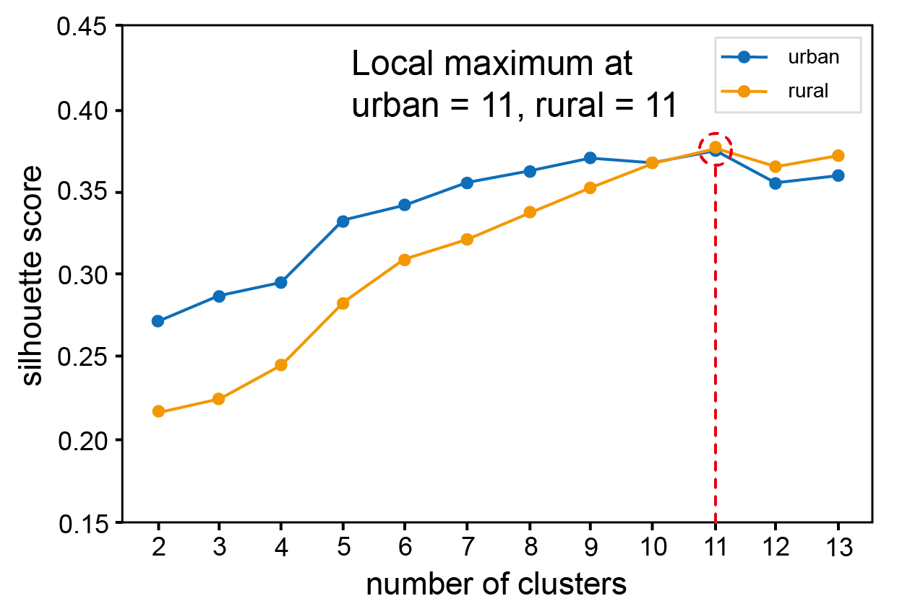

## Contents   

__Figure__  
1. [__FigureS1__](#FigureS1)  
2. [__FigureS2__](#FigureS2)  
3. [__FigureS3__](#FigureS3)  
4. [__FigureS4__](#FigureS4)  
5. [__FigureS5__](#FigureS5)
6. [__FigureS6__](#FigureS6)
7. [__FigureS7__](#FigureS7)
8. [__FigureS8__](#FigureS8)
9. [__FigureS9__](#FigureS9)
10. [__FigureS10__](#FigureS10)

__Table__  
1. [__TableS1__](#TableS1)  
2. [__TableS2__](#TableS2)  
3. [__TableS3__](#TableS3)  
4. [__TableS4__](#TableS4)  
5. [__TableS5__](#TableS5)  
6. [__TableS6__](#TableS6)  
7. [__TableS7__](#TableS7)  
8. [__TableS8__](#TableS8)  
9. [__TableS9__](#TableS9)  
10. [__TableS10__](#TableS10)  

---
## FigureS1
  

### Detail  

Materials path : `../Codes/FigS1_ref/`  

[Back to top](#Contents)

---  

## FigureS2  
  

### Detail  

Materials path : `../Codes/Fig2_ref/`  

[Back to top](#Contents)

---  

## FigureS3  
  

### Detail  

Materials path : `../Codes/Fig2_ref/`  

[Back to top](#Contents)

---  

## FigureS4  
  

### Detail  

Materials path : `../Codes/Fig2_ref/`  

[Back to top](#Contents)

---  

## FigureS5  
  

### Detail  

Materials path : `../Codes/Fig2_ref/`  

[Back to top](#Contents)

---  

## FigureS6  
  

### Detail  

Materials path : `../Codes/Fig2_ref/`  

[Back to top](#Contents)

---  

## FigureS7  
  

### Detail  

Materials path : `../Codes/Fig2_ref/`  

[Back to top](#Contents)

---  

## FigureS8  
  

### Detail  

Materials path : `../Codes/Fig2_ref/`  

[Back to top](#Contents)

---  

## FigureS9  
  

### Detail  

Materials path : `../Codes/Fig2_ref/`  

[Back to top](#Contents)

---  

## FigureS10  
  

### Detail  

Materials path : `../Codes/Fig2_ref/`  

[Back to top](#Contents)

---  

## TableS1
  

Cross-participant agreement measured by the Kendall-τ coefficient (τB) across the POG annotations. (Sat: satellite imagery experts, Loc: North Korean locals and defectors, Eco: economists)

### Detail  

Materials path : `../../Stage2/kendall_tau/` 
Key file :   txt2kendall2.py  

To reproduce the results, please read instructions in `../../Stage2/kendall_tau/` before run a code.  

[Back to top](#Contents)

---  

## TableS2
  

### Detail  

Materials path :  `../Codes/TableS1_ref/`  
Key file :    

[Back to top](#Contents)

---  

## TableS3
  

### Detail  

Materials path : `../Codes/TableS3_ref/`  
Key file :    

[Back to top](#Contents)

---  

## TableS4
  

### Detail  

Materials path : `../Codes/TableS4_ref/`  
Key file :    

[Back to top](#Contents)

---  

## TableS5
  

### Detail  

Materials path : `../Codes/TableS5_ref/`  
Key file :    

[Back to top](#Contents)

---  

## TableS6
  

### Detail  

Materials path : `../Codes/TableS6_ref/`  
Key file :    

[Back to top](#Contents)

---  

## TableS7
  

### Detail  

Materials path : `../Codes/TableS7_ref/`  
Key file :    

[Back to top](#Contents)

---  

## TableS8
  

### Detail  

Materials path : `../Codes/TableS8_ref/`  
Key file :    

[Back to top](#Contents)

---  

## TableS9
  

### Detail  

Materials path : `../Codes/TableS9_ref/`  
Key file :    

[Back to top](#Contents)

---  

## TableS10
  

### Detail  

Materials path : `../Codes/TableS10_ref/`  
Key file :    

[Back to top](#Contents)

---  

