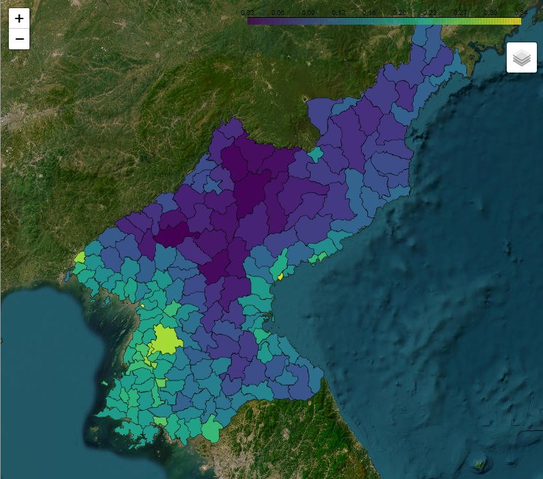
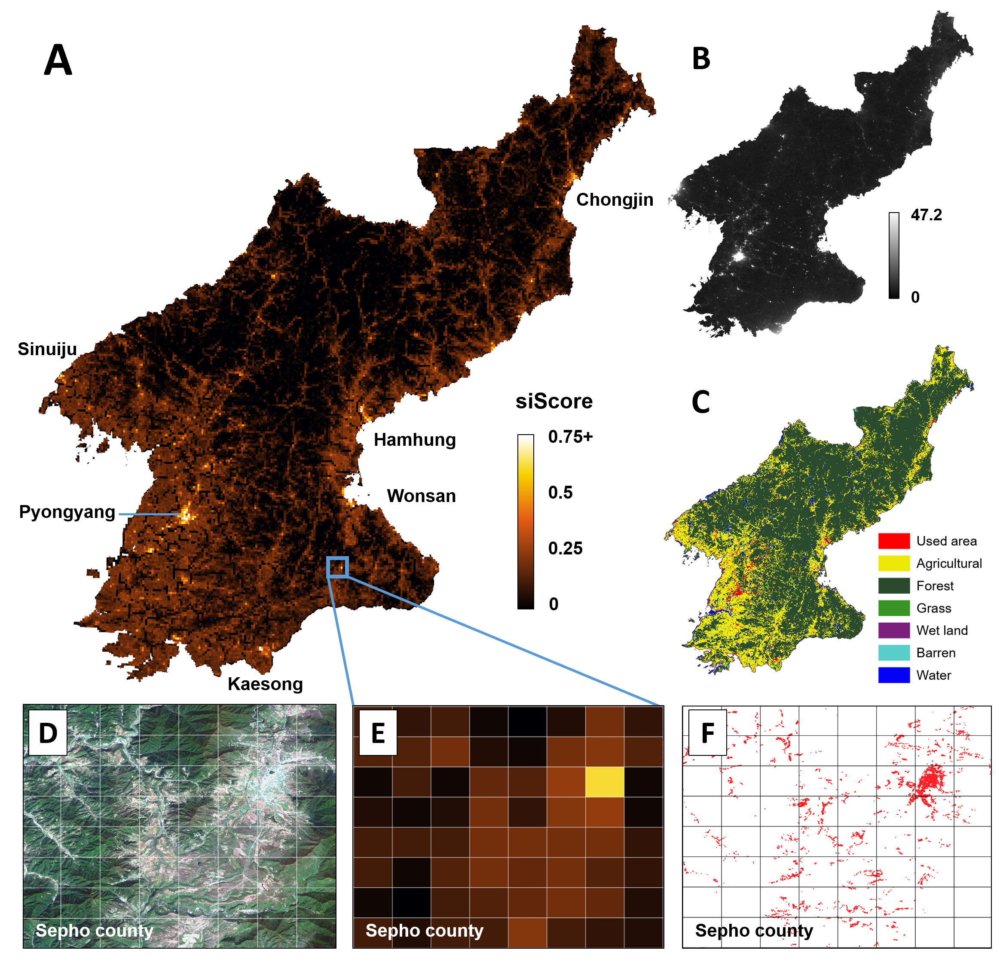

# A human-machine collaborative approach measures economic development using satellite imagery

This repository is official implementation of 'A human-machine collaborative approach measures economic development using satellite imagery'.


---  

## Model description  
  

To train the scoring model *siScore*, you need to follow three stages: `Stage1`, `Stage2`, `Stage3`.  
`Stage1` first conducts pre-training, and then generates the clusters from given satellite imagery via *DeepCluster*.  
`Stage2` suggests ensemble method for aggregating human-guided weak-supervision in reasonable way. *Humman* annotators first label the partial orders between the clusters from `Stage1`. Then, the *Machine* ensembles the all labels from the human, and prune some clusters for better training.  
`Stage3` trains the rank-wise score model *siScore* from the `Stage2`'s label (*Ensemble POG*).   
Please refer to `README.md` in each stage's directory (i.e., `Stage1`, `Stage2`, `Stage3`) to get started.  
Dataset in ```data``` directory is sampled example from the original dataset. The code is implemented according to its format, so use them just for the reference.  

---  

## siScore prediction on North Korea  
### Interactive siScore map example   
 **District-level siScore map on North Korea**  
 [](https://www.siscore.app/interactive_map/NK-siScore-District/)

Check out for more examples at [siscore.app](siscore.app)

### Visualization of economic development levels predicted by our human-machine collaboration model.  
  

(A) Prediction scores over grid images averaged over four years from 2016 to 2019, (B) shows the yearly aggregated VIIRS nightlight data in 2019, and (C) shows the land cover classification map released by the South Korean Government in 2019. The zoomed-in views in (D–F) compare predictions for Sepho County in the Kangwon region. From left to right are the Sentinel-2 satellite images taken in 2019 (D), model predictions (E), and manually verified buildings colored red from the building footprint data in 2014 (F).

---
## Reproducing Figs/Tables  

To reproduce the Figures and Tables in the ...     

[__Main text__](https://github.com/DonghyunAhn/development-measure/tree/main/Materials/Main)  
[__Supplemetary Materials__](https://github.com/DonghyunAhn/development-measure/tree/main/Materials/Supplementary)  

please follow the instructions provided at the links above.  

---  

## Software  

### Module dependencies

This code has been tested and confirmed to be reproducible with  or higher versions, and has been developed using .  

Also, all code has been tested on the following environment :
```
torch==1.11.0
torchvision==0.8.2
numpy==1.19.2
scipy==1.6.2
sklearn==0.23.2
scikit-image==0.19.2
pandas==1.1.4
geopandas==0.10.2
Pillow=8.2.0
opencv-python==4.7.0.72
faiss-cpu==1.7.3
faiss-gpu==1.7.2
```

Following command can replicate the full environment :

```pip install -r requirements.txt```

---  

## Hardware  

### GPU server specification  

GPU spec : 4x NVIDIA TITAN Xp  
OS : linux 4.4.0-190-generic  

---  
 
Contributor : DA, EL, JY