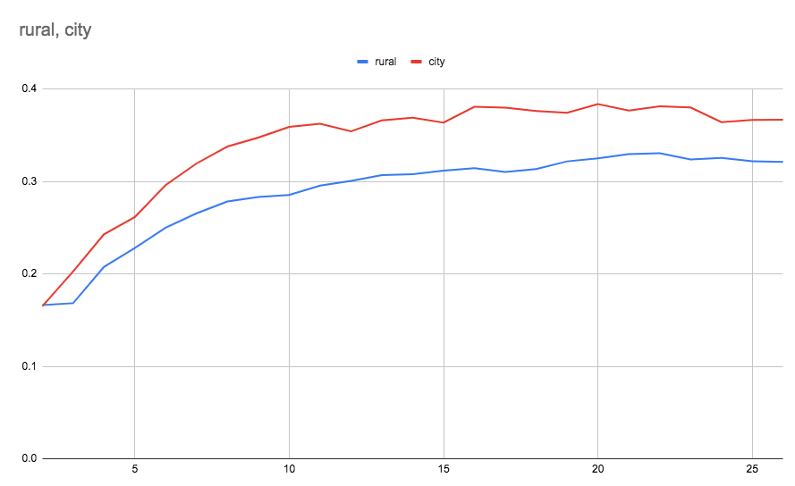

## Step 1. Pretrain
***

### 0) Download Optimizer

Download optimizer from https://github.com/lessw2020/Ranger-Deep-Learning-Optimizer
Rename directory into Ranger.

### 1) Annotate sample images

Choose 1,000 sample imagery from entire dataset. Human anotates 1,000 images among 3 categories : Urban, Rural, and Uninhabited. Make annotation result into single file and save this file and sample image (Refer to "lao_1_annotation" directory)


### 2) Pre-training

Pretrain model with default values of hyper-parameter defined in utils/parameters.py, pretrain_parser().


```
usage: 1_pretrain.py [-h] [--img IMG] [--name NAME]

pretrain parser

optional arguments:
  -h, --help            show this help message and exit
  --img IMG             name of the image directory
  --name NAME           model & annotated directory name

```

Example

```$python3 1_pretrain.py --name nk --img NK```

Saved Model Example

```checkpoint_sample/nk_resnet18_200.ckpt```


## Step 2. Clustering
***

### 1) Train clustering model

Train clustering model and print silhouete score for each cluster number with default values of hyper-parameter defined in utils/parameters.py, siCluster_parser().


```
usage: 2_train_cluster.py [-h] [--lr LR] [--epochs EPOCHS] [--batch BATCH]
                          [--momentum MOMENTUM] [--seed SEED]
                          [--nmb_cluster NMB_CLUSTER] [--name NAME]
                          [--img IMG]

siCluster parser

optional arguments:
  -h, --help            show this help message and exit
  --lr LR               learning rate
  --epochs EPOCHS       number of total epochs to run
  --batch BATCH         mini-batch size
  --momentum MOMENTUM   momentum
  --seed SEED           random seed
  --nmb_cluster NMB_CLUSTER, --k NMB_CLUSTER
                        number of cluster for k-means
  --name NAME           model & annotated directory name
  --img IMG             name of the image directory
  
```


Example

```$python3 2_train_cluster.py --name nk --img NK```

Example output
```
score of cluster 2 in city is 0.23308715224266052
score of cluster 2 in rural is 0.1826467216014862
28228
score of cluster 3 in city is 0.3172442615032196
score of cluster 3 in rural is 0.21523277461528778
28228
score of cluster 4 in city is 0.31919488310813904
score of cluster 4 in rural is 0.2555907666683197
28228
score of cluster 5 in city is 0.3550056517124176
score of cluster 5 in rural is 0.27716973423957825
28228
score of cluster 6 in city is 0.3651943504810333
score of cluster 6 in rural is 0.2997937500476837
28228
score of cluster 7 in city is 0.37277963757514954
score of cluster 7 in rural is 0.30695897340774536
28228
score of cluster 8 in city is 0.37767258286476135
score of cluster 8 in rural is 0.3295610845088959
28228
score of cluster 9 in city is 0.35936102271080017
score of cluster 9 in rural is 0.3287757635116577
28228
score of cluster 10 in city is 0.36402201652526855
score of cluster 10 in rural is 0.3369346857070923
28228
score of cluster 11 in city is 0.36379972100257874
score of cluster 11 in rural is 0.3478984832763672
28228
score of cluster 12 in city is 0.34054693579673767
score of cluster 12 in rural is 0.35063880681991577
28228
score of cluster 13 in city is 0.3443746864795685
score of cluster 13 in rural is 0.35140401124954224
28228
score of cluster 14 in city is 0.3437444865703583
score of cluster 14 in rural is 0.3595753610134125
28228
score of cluster 15 in city is 0.3493868410587311
score of cluster 15 in rural is 0.363513708114624
28228
score of cluster 16 in city is 0.3435173034667969
score of cluster 16 in rural is 0.3623919188976288
28228
score of cluster 17 in city is 0.3413296341896057
score of cluster 17 in rural is 0.356187105178833
28228
score of cluster 18 in city is 0.34615588188171387
score of cluster 18 in rural is 0.3595140278339386
28228
score of cluster 19 in city is 0.31027862429618835
score of cluster 19 in rural is 0.36515888571739197
28228
score of cluster 20 in city is 0.3242522180080414
score of cluster 20 in rural is 0.36439910531044006
```

Saved Model Example

```checkpoint_sample/ckpt_cluster_nk_50_pretrained.t7```

### 2) Decide number of clusters

Human decide number of clusters referring to silhouette scores in previous step.



Choose cluster number which makes a peak (ex) 11 for city, 8 for rural)


### 3) Extract clusters

Extract clusters with default values of hyper-parameter defined in utils/parameters.py, extract_cluster_parser().

```
usage: 3_extract_cluster.py [-h] [--city_cnum CITY_CNUM]
                            [--rural_cnum RURAL_CNUM] [--name NAME]
                            [--img IMG]

extract_cluster parser

optional arguments:
  -h, --help            show this help message and exit
  --city_cnum CITY_CNUM
                        number of city clusters
  --rural_cnum RURAL_CNUM
                        number of rural clusters
  --name NAME           model & annotated directory name
  --img IMG             name of the image directory
```


Example

```$python3 3_extract_cluster.py --name nk --img NK --city_cnum 11 --rural_cnum 11```

