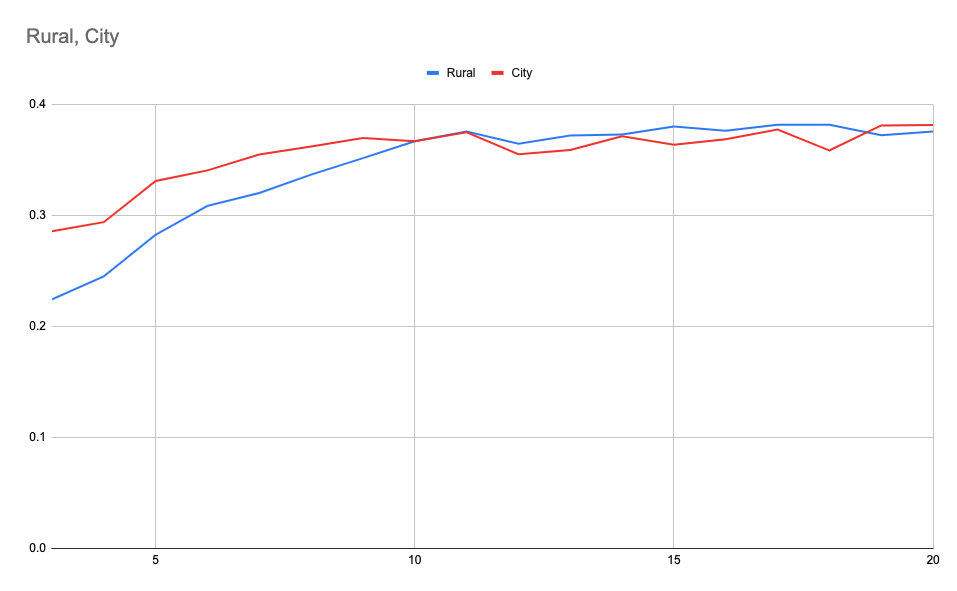

## Step 1. Pretrain
***

### 0) Download Optimizer

Download optimizer from https://github.com/lessw2020/Ranger-Deep-Learning-Optimizer
Rename directory into Ranger.

### 1) Annotate sample images

Choose 1,000 sample imagery from entire dataset. Human anotates 1,000 images among 3 categories : Urban, Rural, and Uninhabited. Make annotation result into single file and save this file and sample image (Refer to "data_sample/nk_annotation" directory)


### 2) Pre-training

Pretrain model with default values of hyper-parameter defined in utils/parameters.py, pretrain_parser().


```
usage: 1_pretrain.py [-h] [--img IMG] [--name NAME]

pretrain parser

optional arguments:
  -h, --help            show this help message and exit
  --img IMG             name of the image directory
  --name NAME           model & annotated directory name

```

Example

```$python3 1_pretrain.py --name nk --img NK```

Saved Model Example

```checkpoint_sample/nk_resnet18_200.ckpt```


## Step 2. Clustering
***

### 1) Train clustering model

Train clustering model and print silhouete score for each cluster number with default values of hyper-parameter defined in utils/parameters.py, siCluster_parser().


```
usage: 2_train_cluster.py [-h] [--lr LR] [--epochs EPOCHS] [--batch BATCH]
                          [--momentum MOMENTUM] [--seed SEED]
                          [--nmb_cluster NMB_CLUSTER] [--name NAME]
                          [--img IMG]

siCluster parser

optional arguments:
  -h, --help            show this help message and exit
  --lr LR               learning rate
  --epochs EPOCHS       number of total epochs to run
  --batch BATCH         mini-batch size
  --momentum MOMENTUM   momentum
  --seed SEED           random seed
  --nmb_cluster NMB_CLUSTER, --k NMB_CLUSTER
                        number of cluster for k-means
  --name NAME           model & annotated directory name
  --img IMG             name of the image directory
  
```


Example

```$python3 2_train_cluster.py --name nk --img NK```

Example output
```
score of cluster 2 in city is 0.27153215
score of cluster 2 in rural is 0.21534321
28228
score of cluster 3 in city is 0.28592879
score of cluster 3 in rural is 0.22450353
28228
score of cluster 4 in city is 0.29413882
score of cluster 4 in rural is 0.24524941
28228
score of cluster 5 in city is 0.33135733
score of cluster 5 in rural is 0.28279155
28228
score of cluster 6 in city is 0.34089294
score of cluster 6 in rural is 0.30885565
28228
score of cluster 7 in city is 0.3551313
score of cluster 7 in rural is 0.32053727
28228
score of cluster 8 in city is 0.36246109
score of cluster 8 in rural is 0.33708602
28228
score of cluster 9 in city is 0.37006819
score of cluster 9 in rural is 0.35190398
28228
score of cluster 10 in city is 0.36707437
score of cluster 10 in rural is 0.36709133
28228
score of cluster 11 in city is 0.37528804
score of cluster 11 in rural is 0.37606084
28228
score of cluster 12 in city is 0.35541421
score of cluster 12 in rural is 0.36503494
28228
score of cluster 13 in city is 0.35932538
score of cluster 13 in rural is 0.37247744
28228
score of cluster 14 in city is 0.37169257
score of cluster 14 in rural is 0.37317824
28228
score of cluster 15 in city is 0.36401796
score of cluster 15 in rural is 0.38054481
28228
score of cluster 16 in city is 0.36889473
score of cluster 16 in rural is 0.37675411
28228
score of cluster 17 in city is 0.37774381
score of cluster 17 in rural is 0.3821744
28228
score of cluster 18 in city is 0.35884652
score of cluster 18 in rural is 0.38213742
28228
score of cluster 19 in city is 0.38149205
score of cluster 19 in rural is 0.37252098
28228
score of cluster 20 in city is 0.38182408
score of cluster 20 in rural is 0.37596616
```

Saved Model Example

```checkpoint_sample/ckpt_cluster_nk_50_pretrained.t7```

### 2) Decide number of clusters

Human decide number of clusters referring to silhouette scores in previous step.



Choose cluster number which makes a peak (ex) 11 for city, 11 for rural)


### 3) Extract clusters

Extract clusters with default values of hyper-parameter defined in utils/parameters.py, extract_cluster_parser().

```
usage: 3_extract_cluster.py [-h] [--city_cnum CITY_CNUM]
                            [--rural_cnum RURAL_CNUM] [--name NAME]
                            [--img IMG]

extract_cluster parser

optional arguments:
  -h, --help            show this help message and exit
  --city_cnum CITY_CNUM
                        number of city clusters
  --rural_cnum RURAL_CNUM
                        number of rural clusters
  --name NAME           model & annotated directory name
  --img IMG             name of the image directory
```


Example

```$python3 3_extract_cluster.py --name nk --img NK --city_cnum 11 --rural_cnum 11```

Clustering Result Example

```data_sample/cluster_nk_11_11```