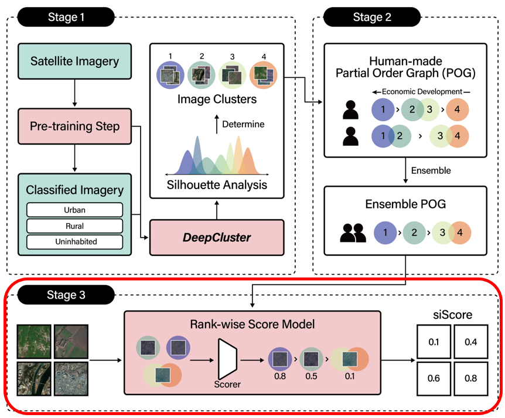

# SiScore

  
Train model and extract score with default values of hyper-parameter defined in utils/parameters.py, siScore_parser().


```
usage: 4_siScore.py [-h] [--lr LR] [--batch-sz BATCH_SZ] [--epochs EPOCHS]
                    [--load] [--modelurl MODELURL] [--seed SEED] [--lamb LAMB]
                    [--alpha ALPHA] [--dir_name DIR_NAME]
                    [--cluster_num CLUSTER_NUM] [--model MODEL]
                    [--graph_config GRAPH_CONFIG] [--name NAME] [--img IMG]

siScore parser

optional arguments:
  -h, --help            show this help message and exit
  --lr LR, --learning-rate LR
                        learning rate
  --batch-sz BATCH_SZ   batch size
  --epochs EPOCHS       total epochs
  --load                load trained model
  --modelurl MODELURL   model path
  --seed SEED           random seed
  --lamb LAMB           lambda parameter for differentiable ranking
  --alpha ALPHA         alpha parameter for differentiable ranking
  --dir_name DIR_NAME   directory name for cluster data
  --cluster_num CLUSTER_NUM
                        number of clusters
  --model MODEL         Model name
  --graph_config GRAPH_CONFIG
                        graph config path
  --name NAME           model & annotated directory name
  --img IMG             name of the image directory
```

Example

```$python3 4_siScore.py --model final_NK.ckpt --graph_config nk.txt --cluster_num 23 --dir_name cluster_nk_11_11 --img NK --name nk```

Scoring Result Example

```nk_NK_scores.csv```

Saved Model Example

```checkpoint_sample/final_nk.ckpt```  

In our environment, this took 13.94 seconds per each epoch.  